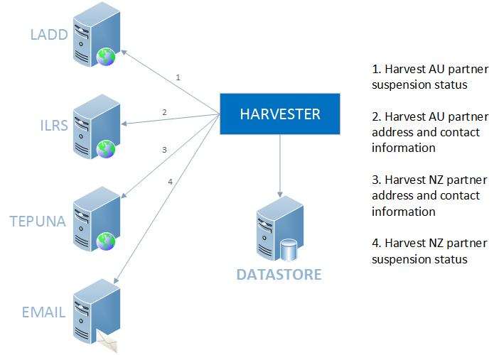
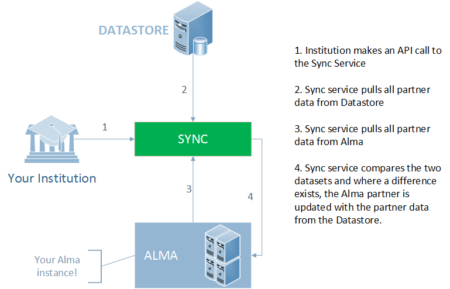
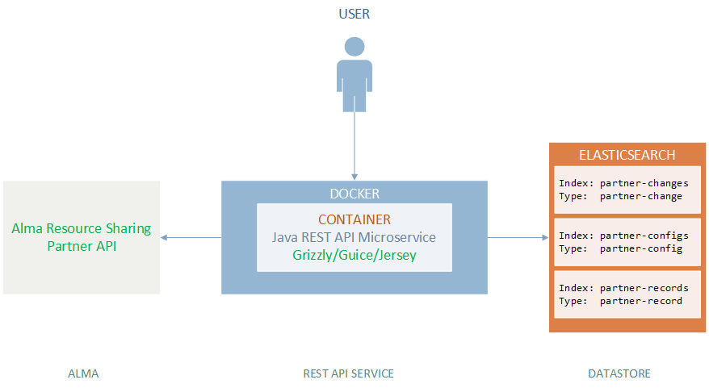

# Partner Synchronisation with Alma

* TOC
{:toc}

## Build
__Requirements:__
1. Java 8
1. Maven

__Build Command:__
```
mvn -DskipTests -P prd clean package
```

This should create a package under the target/ folder: __```resource-sharing-partners-sync-x.x.x-dist.(zip|tar.gz)```__

Unzip/untar the appropriate package to desired location. Edit the file ```resource-sharing-partners-sync.sh``` and replace the variables with their appropriate values.

```
#!/bin/bash

APP=${project.artifactId}-${project.version}.jar

export ALMA_URL=${alma.url}
export ELASTIC_URL=${elastic.url}
export ELASTIC_USR=${elastic.usr}
export ELASTIC_PWD=${elastic.pwd}
export SYNC_HOST=${sync.host}
export SYNC_PORT=${sync.port}
export SYNC_PATH=${sync.path}

JAVA_OPTS="-Xms1g -Xmx1g"

java $JAVA_OPTS -jar $APP $*
```

Execute the file to start the server.

Obtain the Swagger file from: ```http://${sync.host}:${sync.port}/${sync.path}/swagger.json```


## Introduction
There are around 1200 institutions across Australia and New Zealand in the ILL (Inter Library Lending) partner network. To facilitate the ILL service, information regarding these partners is required. For each partner we require address and contact information and their suspension status.

While using the VDX system this information was centrally managed/updated. Partners using VDX had no need to manage any of this data. The same is true for partners using Relais (and possibly others).

Moving to Alma Resource Sharing the model is different. Although offering a much better level of service to our customers by having an integrated ILL solution with their LMS (Library Management System), partner managment becomes the burden of every partner using Alma Resource Sharing. There is no longer a centralised point of management for partner data.

This project seeks to provide a solution to enable automated loading and syncing of Resource Partners with the Alma system.


## Problem
We require the synchronisation of data for resource partners into Alma. There are multiple sources for this data and unfortunately there is no simple interface to obtain this information. Sources of data include web pages, web applications, csv files and emails. Breaking down the data requirements into the following four categories which align to the different data sources, we get the following:

1. _Australia_
   - Address and contact information:
     Web application: http://www.nla.gov.au/apps/ilrs
   - Suspension status:
     Website: https://www.nla.gov.au/librariesaustralia/connect/find-library/ladd-members-and-suspensions
2. _New Zealand_
   - Address and contact information:
     CSV: http://natlib.govt.nz/directory-of-new-zealand-libraries.csv
   - Suspension status:
     Email (structured)

Address and contact information for Australia can found at http://www.nla.gov.au/apps/ilrs. The page is a form that takes a NUC code for an institution and returns the address and contact information for that institution. This must be repeated for each Australian institution that is a part of the network. The result page then needs to be scraped.

Suspension information and NUC symbols for Australian partner institutions are located at https://www.nla.gov.au/librariesaustralia/connect/find-library/ladd-members-and-suspensions. This page needs to be scraped to obtain whether partners are currently active or suspended. This is the most frequently changing data segment and needs to be updated at least daily.

Address and contact information for New Zealand partner information is provided by the National Library of New Zealand in the form of a maintained CSV file that is found at http://natlib.govt.nz/directory-of-new-zealand-libraries.csv.

Suspension information for New Zealand libraries is the most difficult to obtain as there is no complete list of current statuses. Instead, changed status information is broadcasted via email to subscribed email addresses. The status emails are encoded in a custom format that allows status change requests to be processed provided you have developed software to do so.

## Solution
Due to the complexity of the source data, it is not advisable to create a direct synchronisation to Alma as we cannot rely on source system text structure remaining unchanged. We will instead break the problem into two parts: -
1. An application that harvests the information and updates a local data store.
1. An application that synchronises the local data store with Alma.

This provides us with a buffer for Alma should source data systems change or cease to function as expected. It also allows us to slowly change the way we harvest without affecting the data loads into Alma. Over time we are hoping that there will be better mechanisms for sourcing data.


## Implementation

### High Level Design Diagrams

#### Harvesting Resource Sharing Partner Data



#### Synchronising Resource Sharing Partner Data


#### Systems


### ElasticSearch

We use three indexes within ElasticSearch to manage the system. As per the new ElasticSeaerch v6 requirements, there is one type per index:-
1. __partner-records__ - contains the partner-record type which is a complete representation of a resource sharing partner including address/contact details and suspensions.
```json
{
    "mappings": {
        "partner-record": {
            "properties": {
                "nuc": {
                    "type": "keyword"
                },
                "updated": {
                    "type": "date",
                    "format": "date_time_no_millis"
                },
                "name": {
                    "type": "keyword"
                },
                "enabled": {
                    "type": "boolean"
                },
                "iso_ill": {
                    "type": "boolean"
                },
                "status": {
                    "type": "keyword"
                },
                "email_main": {
                    "type": "text"
                },
                "email_ill": {
                    "type": "text"
                },
                "phone_main": {
                    "type": "text"
                },
                "phone_ill": {
                    "type": "text"
                },
                "phone_fax": {
                    "type": "text"
                },
                "suspension": {
                    "properties": {
                        "suspension_added": {
                            "type": "date",
                            "format": "date_time_no_millis"
                        },
                        "suspension_status": {
                            "type": "keyword"
                        },
                        "suspension_start": {
                            "type": "date",
                            "format": "date_time_no_millis"
                        },
                        "suspension_end": {
                            "type": "date",
                            "format": "date_time_no_millis"
                        },
                        "suspension_code": {
                            "type": "keyword"
                        },
                        "suspension_reason": {
                            "type": "text"
                        }
                    }
                },
                "addresses": {
                    "properties": {
                        "address_status": {
                            "type": "keyword"
                        },
                        "address_type": {
                            "type": "keyword"
                        },
                        "address_detail": {
                            "properties": {
                                "line1": {
                                    "type": "text"
                                },
                                "line2": {
                                    "type": "text"
                                },
                                "line3": {
                                    "type": "text"
                                },
                                "line4": {
                                    "type": "text"
                                },
                                "line5": {
                                    "type": "text"
                                },
                                "city": {
                                    "type": "keyword"
                                },
                                "state_province": {
                                    "type": "keyword"
                                },
                                "postal_code": {
                                    "type": "keyword"
                                },
                                "country": {
                                    "properties": {
                                        "value": {
                                            "type": "keyword"
                                        },
                                        "@desc": {
                                            "type": "keyword"
                                        }
                                    }
                                },
                                "address_note": {
                                    "type": "text"
                                },
                                "start_date": {
                                    "type": "date",
                                    "format": "date_time_no_millis"
                                },
                                "end_date": {
                                    "type": "date",
                                    "format": "date_time_no_millis"
                                },
                                "address_types": {
                                    "type": "keyword"
                                }
                            }
                        }
                    }
                }
            }
        }
    }
}
```
sample:
```json
{
    "nuc": "NMQU",
    "updated": "2018-01-22T13:05:07+1100",
    "name": "Macquarie University Library",
    "enabled": true,
    "iso_ill": true,
    "status": "not suspended",
    "email_main": null,
    "email_ill": "lib.ill@mq.edu.au",
    "phone_main": null,
    "phone_ill": "02 9850 7514",
    "phone_fax": "02 9850 6516",
    "suspensions": [],
    "addresses": [
        {
            "address_detail": {
                "country": {
                    "@desc": "Australia",
                    "value": "AUS"
                },
                "city": "NORTH RYDE",
                "state_province": "NSW",
                "postal_code": "2109",
                "line1": "Balaclava Rd, cnr Epping Rd"
            },
            "address_type": "main",
            "address_status": "active"
        },
        {
            "address_detail": {
                "country": {
                    "@desc": "Australia",
                    "value": "AUS"
                },
                "city": "MACQUARIE UNIVERSITY",
                "state_province": "NSW",
                "postal_code": "2109",
                "line2": "Macquarie Drive",
                "line1": "Building C3C"
            },
            "address_type": "postal",
            "address_status": "active"
        },
        {
            "address_detail": {
                "line1": "Same as Postal address"
            },
            "address_type": "billing",
            "address_status": "active"
        }
    ]
}
```
2. __partner-changes__ - contains the partner-change type which represents a value change for fields in the partner record. There is a before and after describing what the value was and is respectively.
```json
{
    "mappings": {
        "partner-change": {
            "properties": {
                "time": {
                    "type": "date",
                    "format": "date_time_no_millis"
                },
                "source_system": {
                    "type": "keyword"
                },
                "nuc": {
                    "type": "keyword"
                },
                "field": {
                    "type": "keyword"
                },
                "before": {
                    "type": "text"
                },
                "after": {
                    "type": "text"
                }
            }
        }
    }
}
```
sample:
```json
{
    "time": "2018-02-14T12:15:05+1100",
    "source_system": "TEPUNA",
    "nuc": "NLNZ:TAUY",
    "field": "phone_ill",
    "before": "+64 7 557 8985",
    "after": "+64 7 557 8695"
}
```
3. __partner-configs__ - contains the partner-config type which has no structural definition. The data is typically key/value pairs. The partner-config stores site specific configuration values for Alma for an institution. These setting control any site specific values used when the service renders the partner. Configuration for harvesting modules are also stored in this  index.
```
{}
```
sample:
```json
{
    "linkBase": "https://api-ap.hosted.exlibrisgroup.com/almaws/v1/partners/",
    "currency": "AUD",
    "borrowingSupported": true,
    "borrowingWorkflow": "LADD_Borrowing",
    "lendingSupported": true,
    "lendingWorkflow": "LADD_Lending",
    "avgSupplyTime": 4,
    "deliveryDelay": 4,
    "locateProfileDesc": "LADD Locate Profile",
    "locateProfileValue": "LADD",
    "systemTypeDesc": "LADD",
    "systemTypeValue": "LADD",
    "isoAlternativeDocumentDelivery": false,
    "isoIllServer": "nla.vdxhost.com",
    "isoIllPort": "1611",
    "isoRequestExpiryTypeDesc": "Expire by interest date",
    "isoRequestExpiryTypeValue": "INTEREST_DATE",
    "isoSendRequesterInformation": false,
    "isoSharedBarcodes": true,
    "isoSymbol": "NLA:NMQU"
}
```

### Synchronisation
#### Understanding the Synchronisation Process
1. An institution makes an API call to the Sync REST service. The organisations NUC symbol is passed in the URI (in the example, '__NMQU__'). In addition, the institution passes along their ExLibris APIKEY that has read/write permissions to their Alma instance's [Resource Sharing Partners API](https://developers.exlibrisgroup.com/alma/apis/partners).
   Example call using CURL:
   ```
   curl -XGET -H 'Authorization:apikey l7xxxxxxxxxxxxxxxxxxxxxxxxxxxxxxxxxx' https://api.hosted.somewhere.org/v1/partner-sync/NMQU/sync
   ```
   
1. The Sync service fetches all partners from Alma using the Resource Sharings Partners API.
1. The Sync service fetches all partners from the ElasticSearch partner-records index.
1. The Sync service fetches the configuration for the institution based on the NUC code provided from the ElasticSearch partner-configs index.
1. For each of the partners from the datastore, the data from the configuration for the institution, based on the NUC code, and the partner record is combined to create a represetnation of the partner institution that mirrors the institution in Alma. This includes having calculated the suspension status.
1. We compare each of the newly created representations with their counterparts from Alma:
   - if the counterpart does not exist, we create a new Alma record and we create a new 'change' record in the partner-changes index logging the creation.
   - if the counterpart does not match, we update the Alma record and we create a new 'change' record in the partner-changes index logging each field that was changed with both the old and the new values.
   - if the counterpart does match, we do nothing.
1. At the end of the process we may have Alma partners that have not been processed as there were no ElasticSearch entries for those items. These are either custom records or records that could be deleted. We refer to these as _'orphaned'_ records. The sync service does not delete any records - it only sets them as __Active__ or __Inactive__.

#### Synchronisation Record Generation
As already stated, an Alma record is an amalgamation of the Datastore representation of an organisation and the loading institutions configuration.
```
DATASTORE RECORD + INSTITUTION CONFIGURATION = ALMA RECORD

```

__DATASTORE RECORD:__
```json
{
  "partner_details": {
    "code": "NCN",
    "name": "Katie Zepps Nursing Library",
    "status": "ACTIVE",
    "profile_details": {
      "profile_type": "ISO",
      "iso_details": {
        "alternative_document_delivery": false,
        "ill_server": "nla.vdxhost.com",
        "ill_port": 1611,
        "iso_symbol": "NLA:NCN",
        "request_expiry_type": {
          "value": "INTEREST_DATE",
          "desc": "Expire by interest date"
        },
        "send_requester_information": false,
        "shared_barcodes": true,
        "ignore_shipping_cost_override": false
      }
    },
    "system_type": {
      "value": "LADD",
      "desc": "LADD"
    },
    "avg_supply_time": 4,
    "delivery_delay": 4,
    "currency": "AUD",
    "borrowing_supported": true,
    "borrowing_workflow": "LADD_Borrowing",
    "lending_supported": true,
    "lending_workflow": "LADD_Lending",
    "locate_profile": {
      "value": "LADD",
      "desc": "LADD Locate Profile"
    },
    "holding_code": "NCN"
  },
  "contact_info": {
    "address": [
      {
        "line1": "Level 6",
        "city": "PARRAMATTA",
        "line2": "9 Wentworth Street",
        "line3": null,
        "line4": null,
        "line5": null,
        "state_province": "NSW",
        "postal_code": "2150",
        "country": {
          "value": "AUS",
          "desc": "Australia"
        },
        "start_date": "2017-09-07Z",
        "address_type": [
          "ALL"
        ],
        "preferred": false
      },
      {
        "line1": "PO Box 650",
        "city": "PARRAMATTA",
        "line2": null,
        "line3": null,
        "line4": null,
        "line5": null,
        "state_province": "NSW",
        "postal_code": "2124",
        "country": {
          "value": "AUS",
          "desc": "Australia"
        },
        "start_date": "2017-09-07Z",
        "address_type": [
          "shipping"
        ],
        "preferred": false
      }
    ],
    "phone": [
      {
        "phone_number": "02 9745 7536",
        "phone_type": [
          "claim_phone",
          "order_phone",
          "payment_phone",
          "returns_phone"
        ],
        "preferred": false,
        "preferredSMS": null
      }
    ],
    "email": [
      {
        "email_address": "library.technician@acn.edu.au",
        "description": null,
        "email_type": [
          "ALL"
        ],
        "preferred": false
      }
    ]
  },
  "note": [],
  "link": "https://api-ap.hosted.exlibrisgroup.com/almaws/v1/partners/NCN"
}
```

__+__

__INSTITUTION CONFIGURATION__
```json
{
  "linkBase": "https://api-ap.hosted.exlibrisgroup.com/almaws/v1/partners/",
  "currency": "AUD",
  "borrowingSupported": true,
  "borrowingWorkflow": "LADD_Borrowing",
  "lendingSupported": true,
  "lendingWorkflow": "LADD_Lending",
  "avgSupplyTime": 4,
  "deliveryDelay": 4,
  "locateProfileDesc": "LADD Locate Profile",
  "locateProfileValue": "LADD",
  "systemTypeDesc": "LADD",
  "systemTypeValue": "LADD",
  "isoAlternativeDocumentDelivery": false,
  "isoIllServer": "nla.vdxhost.com",
  "isoIllPort": "1611",
  "isoRequestExpiryTypeDesc": "Expire by interest date",
  "isoRequestExpiryTypeValue": "INTEREST_DATE",
  "isoSendRequesterInformation": false,
  "isoSharedBarcodes": true,
  "isoSymbol": "NLA:NMQU"
}
```

__=__


__ALMA RECORD__
```json
{
  "partner_details": {
    "code": "NCN",
    "name": "Katie Zepps Nursing Library",
    "status": "ACTIVE",
    "profile_details": {
      "profile_type": "ISO",
      "iso_details": {
        "alternative_document_delivery": false,
        "ill_server": "nla.vdxhost.com",
        "ill_port": 1612,
        "iso_symbol": "NLA:NCN",
        "request_expiry_type": {
          "value": "INTEREST_DATE",
          "desc": "Expire by interest date"
        },
        "send_requester_information": false,
        "shared_barcodes": true,
        "ignore_shipping_cost_override": false
      }
    },
    "system_type": {
      "value": "LADD",
      "desc": "LADD"
    },
    "avg_supply_time": 4,
    "delivery_delay": 4,
    "currency": "AUD",
    "borrowing_supported": true,
    "borrowing_workflow": "LADD_Borrowing",
    "lending_supported": true,
    "lending_workflow": "LADD_Lending",
    "locate_profile": {
      "value": "LADD",
      "desc": "LADD Locate Profile"
    },
    "holding_code": "NCN"
  },
  "contact_info": {
    "address": [
      {
        "line1": "Level 6",
        "city": "PARRAMATTA",
        "line2": "9 Wentworth Street",
        "line3": null,
        "line4": null,
        "line5": null,
        "state_province": "NSW",
        "postal_code": "2150",
        "country": {
          "value": "AUS",
          "desc": "Australia"
        },
        "start_date": "2017-09-07Z",
        "address_type": [
          "ALL"
        ],
        "preferred": false
      },
      {
        "line1": "PO Box 650",
        "city": "PARRAMATTA",
        "line2": null,
        "line3": null,
        "line4": null,
        "line5": null,
        "state_province": "NSW",
        "postal_code": "2124",
        "country": {
          "value": "AUS",
          "desc": "Australia"
        },
        "start_date": "2017-09-07Z",
        "address_type": [
          "shipping"
        ],
        "preferred": false
      }
    ],
    "phone": [
      {
        "phone_number": "02 9745 7536",
        "phone_type": [
          "claim_phone",
          "order_phone",
          "payment_phone",
          "returns_phone"
        ],
        "preferred": false,
        "preferredSMS": null
      }
    ],
    "email": [
      {
        "email_address": "library.technician@acn.edu.au",
        "description": null,
        "email_type": [
          "ALL"
        ],
        "preferred": false
      }
    ]
  },
  "note": [],
  "link": "https://api-ap.hosted.exlibrisgroup.com/almaws/v1/partners/NCN"
}
```
